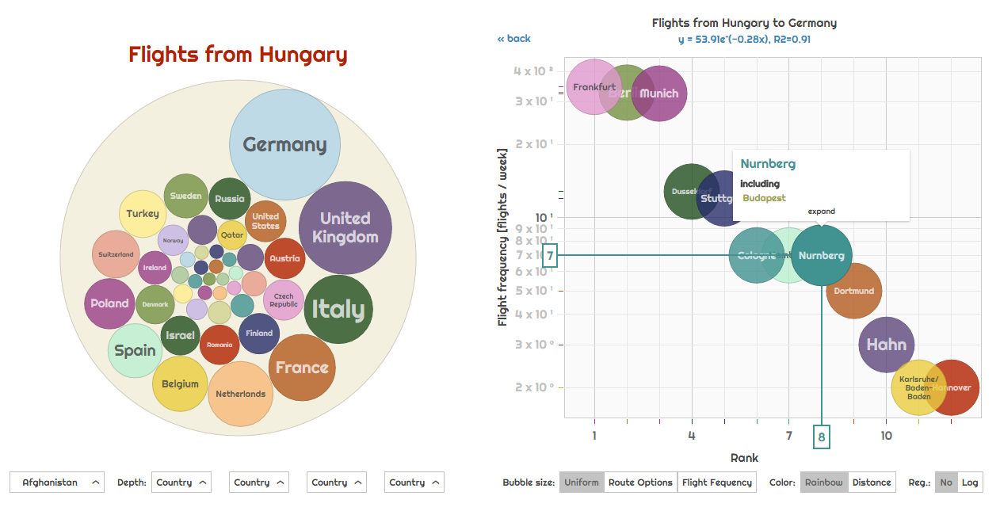

[  FlightRank](http://aviation.csaladen.es/)
======
  
  
This is an interactive visualization interface (_exploratorium_) for all the flights in the world, clustered by countries, cities, airlines and airports. We provide a bubbles visualization and a scatter-plot in a side-by-side layout for easy exploration of the data.
  
__This is an interactive global visualization and exploration interface (_exploratorium_)__.  
    
- Data source was http://airportia.com
- Flights for the first 2 weeks of April 2017 were scraped.
- Data mining, processing and normalization done in `python` and `pandas`.
- Country maps visualized in [D3](http:/d3js.org), such as [this](blog.csaladen.es/airports/ae/) one.
- Main app visualized in [D3plus](http://d3plus.org).

# App
Try: http://aviation.csaladen.es  

# Documentation 
Coming soon
   
# Credit
Dénes Csala, 2017  
http://csaladen.es
